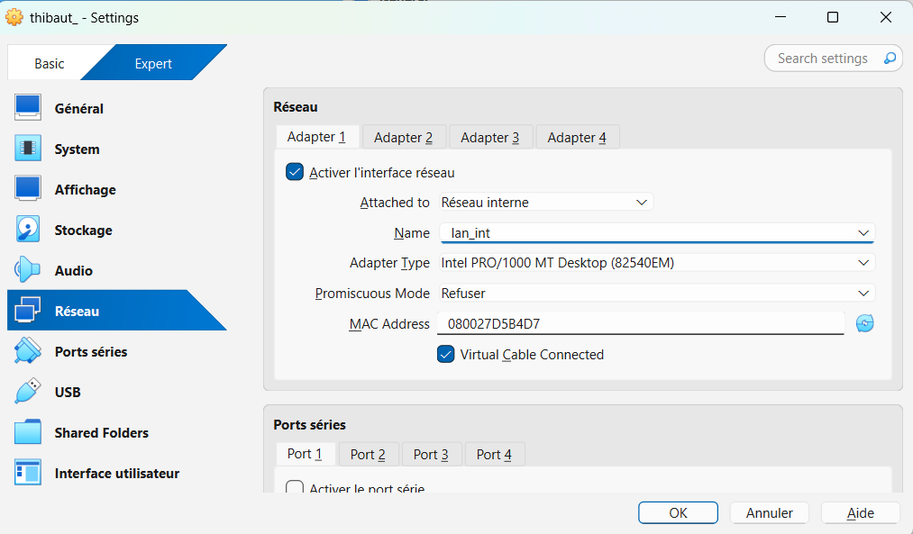
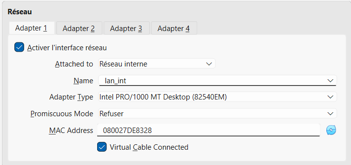
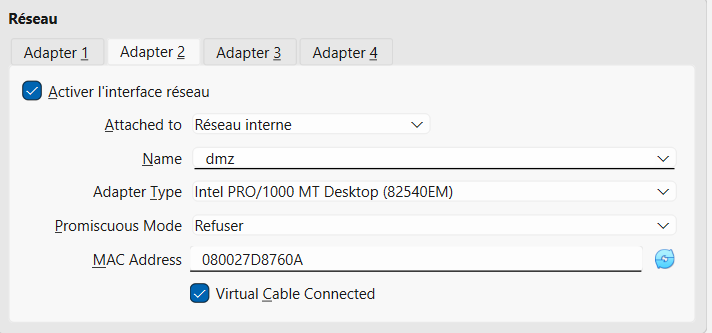
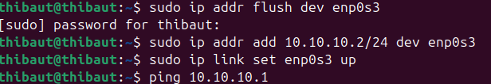
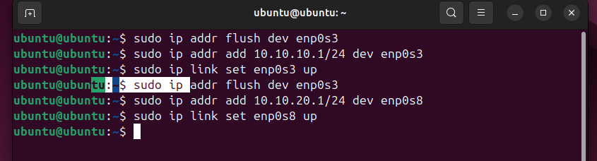
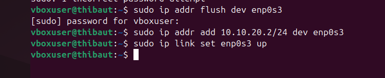
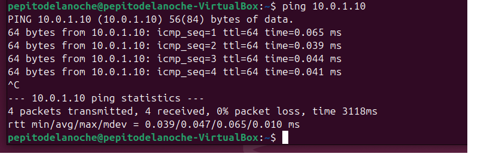

# TP Réseaux — NAT, Pare-feu et petite DMZ

## Objectifs du TP : 

- Reprendre une topologie simple et la faire évoluer vers une petite infra « réaliste ».
- Mettre en place du routage + NAT (masquerading) entre deux réseaux.
- Créer une mini DMZ avec un serveur accessible depuis l’extérieur.
- Ajouter des règles de pare-feu pour contrôler finement les flux.
- Observer les effets des règles (trafic autorisé / bloqué, logs, captures).

## Matériel / prérequis :

- 3 VM Linux : fw (pare-feu/routeur), lan-cli (client LAN), dmz-srv (serveur en DMZ).
- VirtualBox (ou équivalent) installé et fonctionnel.
- 2 réseaux internes VirtualBox distincts :
- lan_int (réseau interne privé).
- dmz (réseau DMZ).
- fw a 2 interfaces :
 - Une sur lan_int
 - Une sur dmz

Toi, avec les bases : IP, masque, passerelle, routage, NAT, pare-feu.

Important : aucun besoin d’Internet réel pour ce TP. On reste dans une maquette « labo ».

## Étape 1 — Configuration IP de base 

- Dans un premier temps , j'ai du aller dans les settings de ma VM puis dans réseau afin de paramétrer mes VMS comme demandé.

### voilà pour ma VM (lan-cli) sur le réseau interne lan_int:

### voilà pour mon routeur/pare-feu (fw):

## et enfin voilà pour mon serveur dmz: 

## Ensuite, j'ai attribué les ip statiques 
- lan-cli:

- routeur/pare-feu (fw):

- serveur dmz:

## Et enfin voici la preuve attendue

### lan-cli → ping vers l’IP lan_int de fw.

